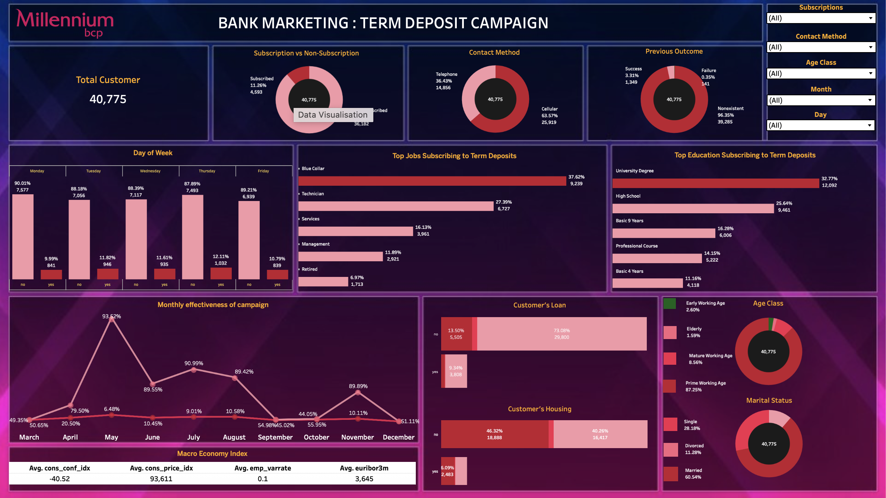

# 1. Business Problem Context

The financial stability of a bank is highly influenced by its ability to mobilize **Third-Party Funds (TPF)**, particularly through **term deposits**. Compared to savings or current accounts, term deposits provide a more stable and predictable source of funding due to their fixed maturity period. This makes them crucial for maintaining **liquidity**, strengthening the **funding structure**, and supporting the bank’s **lending capacity**.

To promote term deposit products, banks often conduct **direct marketing campaigns**, primarily through phone calls to customers and potential clients. However, these campaigns are usually time-consuming and costly, while their success rate remains relatively low. Many potential customers either decline the offer or do not fall into the right target segment, which reduces the overall efficiency of the campaign.

Therefore, analyzing the **Bank Marketing Campaigns Dataset** from a Portuguese bank is essential. This dataset contains customer demographic information, financial attributes, records of previous campaign interactions, as well as macroeconomic indicators. Such data can provide valuable insights into the factors that influence customer's decisions to subscribe to a term deposit.

## 1.1 Stakeholders Overview
Understanding the stakeholders is crucial for this project, as it helps identify who will directly benefit from the analysis and who may use the insights indirectly for strategic decision-making.

- **Primary Stakeholder:** Marketing Department / Campaign Manager  
  - **Reason:** They will directly use the model to **target potential customers**, improve **campaign effectiveness**, and **maximize term deposit conversion rates**.  

- **Indirect Stakeholders:**  
  - **Product/Treasury Team:** Leverages insights for **Third-Party Funds (TPF) strategy** and long-term funding planning.  
  - **Risk & Finance Department:** Assesses the **impact of low customer participation** on liquidity and funding risk.  
  - **Senior Management / Board of Directors:** Supports **strategic decisions** related to resource allocation and campaign planning.

## 1.2 Data Context

**Source:**  
The data comes from direct marketing campaigns conducted by a commercial bank in Portugal. The dataset was later published in the UCI Machine Learning Repository ([link](https://archive.ics.uci.edu/ml/datasets/bank+marketing)) and used in the study: S. Moro, P. Cortez, & P. Rita (2014), *A Data-Driven Approach to Predict the Success of Bank Telemarketing*, *Decision Support Systems*.

**Time:**  
Campaigns were conducted between 2008–2013, covering the post-global financial crisis period, which likely influenced customer behavior and economic conditions. During this period, perceived risks increased, causing some customers to delay or decline term deposit subscriptions, while macroeconomic indicators such as interest rates, inflation, and consumer confidence fluctuated.

**Place:**  
All campaigns were conducted in Portugal at a single commercial bank. The dataset reflects customer characteristics, telemarketing interactions, and the economic environment in Portugal at that time, as well as typical retail banking marketing practices in the country.

**Purpose:**  
The dataset is used for analyzing and predicting whether customers will subscribe to a term deposit, with the target variable **y** (yes/no).

---

## 1.3 Problem Statement 

### 1.3.1 Problem Statement for Machine Learning

How to predict customer subscription to a term deposit (y) so the bank can optimize marketing efficiency and strengthen financial sustainability?

### 1.3.2 Problem Statement for Analytics

What customer should we target in order to increase deposit subscription, improve campaign conversion rates, and strengthen the bank’s long-term funding base?

---

## 1.4 Analytical Approach

What we will do is **analyze historical banking data to uncover patterns** that differentiate customers who are likely to make deposits from those who are not.
Next, we will **develop a classification model** that will help the bank predict the probability of a customer making a deposit. This model can be used to support targeted marketing, customer retention strategies, and overall efforts to increase deposit inflows.

---

## 1.5 Business Process Flow with ML & Evaluation Metrics

### **1.5.1 Before ML (Traditional Campaign)**

The traditional marketing business process (without ML) usually looks like this:

1. **Campaign Planning**  
   → The bank defines the marketing campaign strategy (e.g., promoting term deposits).

   ↓

2. **Target Selection (broad, rule-based)**  
   → Customers are selected based on simple rules.  
   - Example: all customers aged 25–60, or all with savings > Rp10 million.  
   - **Broad** because the target coverage is too general.  
   - **Rule-based** because it relies on static/manual rules from the marketing team.

   ↓

3. **Telemarketing Execution**  
   → The call center team calls the broad target list.

   ↓

4. **Outcome & Evaluation**  
   - Low conversion rate (few customers actually interested).  
   - High campaign cost (many wasted calls).  
   - Inefficient resource allocation (call center agents spend time on uninterested customers).

**Key Point:** Many “missed shots” → campaign becomes costly & ineffective.

### **1.5.2 After ML (Predictive Campaign)**

With the help of machine learning, the flow becomes more efficient:

1. **Data Collection & Feature Engineering**  
   - Data from various sources: demographics, financial status, loan history, previous campaign interactions, economic indicators.  
   - Processed into features for the ML model.

   ↓

2. **ML Model Training**  
   - The model is trained to predict the probability of a customer subscribing to a term deposit.

   ↓

3. **Target Selection (based on predicted probability)**  
   - Customers are prioritized by probability scores.  
   - Example: only calling customers with >70% predicted likelihood of interest.

   ↓

4. **Telemarketing Execution (focused on high-potential customers)**  
   - Call centers focus only on high-potential customers.  
   - Efficiency improves: less time, effort, and cost.

   ↓

5. **Outcome & Evaluation using Metrics**  
   - Evaluation goes beyond conversion rate, also considering model errors:  
     - **Type I Error (False Positive):** calling uninterested customers (wasted cost).  
     - **Type II Error (False Negative):** missing customers who would have subscribed (lost revenue potential).  
   - **Key metrics:**  
     - *F1-score* → balances precision & recall.  
     - *Precision-Recall AUC* → suitable for imbalanced datasets.  
     - *ROC AUC* → measures the model’s ability to distinguish positives vs negatives.

   ↓

6. **Feedback Loop**  
   - New campaign results are fed back to retrain the model.  
   - Model accuracy improves over time (*continuous improvement*).

**Key Point:** ML transforms campaigns from “**broad & costly**” → “**targeted & efficient**”.

---

## 1.6 Metric Evaluation  

### 1.6.1 Positive / Negative  
- **Positive class** = customer subscribes to a term deposit (y = "yes").  
- **Negative class** = customer does not subscribe (y = "no").  

### 1.6.2 Confusion Matrix Before Machine Learning
Before applying machine learning, the confusion matrix is used to evaluate the current marketing strategy's performance. It shows the number of **TP, FP, TN,** and **FN**, helping to identify potential improvements.

|                     | **Predicted: No** | **Predicted: Yes** |
|---------------------|-----------------|------------------|
| **Actual: No**      | True Negative (TN)    Customer does not subscribe and correctly predicted | False Positive (FP)    Customer does not subscribe but predicted |
| **Actual: Yes**     | False Negative (FN)    Customer subscribes but not predicted | True Positive (TP)    Customer subscribes and correctly predicted |

### 1.6.3 Telemarketing Cost and Opportunity Lost
To evaluate the financial impact of marketing decisions, two key cost components are considered: the cost of contacting customers and the potential revenue lost from missed opportunities.

**1. Telemarketing Cost (€10 per Call)**  
- Based on industry benchmarks and academic literature:  
  - *ContactBabel (2021)* and *Call Centre Helper (2022)* report outbound call costs in Western Europe typically range €6–12.  
  - *Gartner (2020)* estimates €8–12 for financial sector calls lasting 6–9 minutes.  
  - Academic sources (*Moro et al., 2014; Hernández-Orallo et al., 2012*) suggest €5–15 per customer.  
- **Conclusion:** €10 per call is a moderate and realistic assumption for Portuguese bank campaigns.

**2. Opportunity Lost (€130 per Customer)**  
- **Definition:** Revenue lost when a potential customer who would have deposited is not contacted (false negative).  
- **Assumptions:**  
  - Focus on average to upper-mid retail customers with a 12-month deposit.  
  - Minimum placement €1,000, reflecting typical Portuguese retail deposits (premium products have higher minimums €2,500–€5,000).  
- **Calculation:**  
  - Deposit interest: €1,000 × 3% NIM = €30  
  - Potential cross-sell: estimated additional profit ≈ €100, based on historical campaign data showing that customers who place a term deposit often purchase other banking products (≈10% of initial deposit).  
  - **Total opportunity lost per customer:** €30 + €100 = €130  
- **Rationale:**  
  - Focuses on actual revenue lost, excluding acquisition costs or overhead.  
  - Using €1,000 as baseline ensures a conservative and realistic estimate for retail customers.  
  - Practical: can be directly applied to **False Negatives (FN)** in the confusion matrix to calculate total potential loss.

### 1.6.4 Baseline Models

#### Model 1: All Assumed Deposit
- **Confusion Matrix:** TP = 919, FP = 7,236, FN = 0  
- **Calculations:**  
  - Total Cost (FP) = 7,236 × €10 = €72,360  
  - Benefit (TP) = 919 × €130 = €119,470  
  - Net Gain = €47,110  
- **Insight:** Despite high FP costs, reaching all potential depositors yields a positive net gain.

#### Model 2: All Assumed No Deposit
- **Confusion Matrix:** TP = 0, FP = 0, FN = 919  
- **Calculations:**  
  - Opportunity Cost (FN) = 919 × €130 = €119,470  
  - Net Gain = –€119,470  
- **Insight:** Missing all potential depositors results in significant losses.

### Summary Table

| Model              | FP    | FN  | TP  | Contact Cost (FP) | Opportunity Cost (FN) | Benefit (TP) | Net Gain      |
| ------------------ | ----- | --- | --- | ---------------- | -------------------- | ------------ | ------------- |
| All Deposit        | 7,236 | 0   | 919 | €72,360          | €0                   | €119,470     | €47,110       |
| All No Deposit     | 0     | 919 | 0   | €0               | €119,470             | €0           | –€119,470     |

**Interpretation:**  
- Cost of **False Negatives (missed opportunities)** is far more critical than **False Positives (unnecessary calls)**.  
- An effective machine learning model should **reduce FP without substantially increasing FN** to maximize net gain.

### 1.6.5 Error Analysis and Metric Implications
- **Type I Error (FP):** Wasted telemarketing cost, reduced campaign efficiency.  
- **Type II Error (FN):** Missed opportunity to gain stable long-term deposits (DPK).  

**Recommended Metrics:**  
- Primary: **F2-score** or **Recall AUC** to minimize false negative with a much higher cost.  
- Secondary: **ROC AUC** or **Lift/Gain Chart** for campaign insights.

---

# 2. Data Understanding

Dataset : 
https://www.kaggle.com/datasets/volodymyrgavrysh/bank-marketing-campaigns-dataset

### 2.1 Attribute Information

Dataset size: **41188 rows** | Columns: **21**

| **Attribute**    | **Data Type** | **Feature Type** | **Description** |
| ---------------- | ------------- | ---------------- | --------------- |
| age              | int64         | Numerical        | Age of the client (in years). |
| job              | object        | Categorical      | Type of job (e.g., admin., technician, services, self-employed, management, retired, student, unemployed, unknown). |
| marital          | object        | Categorical      | Marital status (married, single, divorced, unknown). |
| education        | object        | Categorical      | Education level (primary, secondary, tertiary, unknown). |
| default          | object        | Categorical      | Has credit in default? (yes, no, unknown). |
| housing          | object        | Categorical      | Has a housing loan? (yes, no, unknown). |
| loan             | object        | Categorical      | Has a personal loan? (yes, no, unknown). |
| contact          | object        | Categorical      | Type of communication (cellular, telephone, unknown). |
| month            | object        | Categorical      | Last contact month of the year (jan, feb, …, dec). |
| day_of_week      | object        | Categorical      | Last contact day of the week (mon, tue, wed, thu, fri). |
| duration         | int64         | Numerical        | Last contact duration in seconds. **Note:** strongly correlated with target `y` but only known after the call — should be avoided for real-time predictions. |
| campaign         | int64         | Numerical        | Number of contacts performed during this campaign for this client. |
| pdays            | int64         | Numerical        | Number of days since the client was last contacted in a previous campaign (`-1` means never contacted before). |
| previous         | int64         | Numerical        | Number of contacts performed before this campaign. |
| poutcome         | object        | Categorical      | Outcome of the previous marketing campaign (success, failure, other, unknown). |
| emp.var.rate     | float64       | Numerical        | Employment variation rate — economic indicator related to job changes. |
| cons.price.idx   | float64       | Numerical        | Consumer price index — economic indicator of consumer prices. |
| cons.conf.idx    | float64       | Numerical        | Consumer confidence index — indicator of consumer confidence. |
| euribor3m        | float64       | Numerical        | 3-month Euribor rate (reference interest rate). |
| nr.employed      | float64       | Numerical        | Number of employees (economic indicator, defined in source dataset). |
| y                | object        | Target (Categorical) | Target variable: has the client subscribed to a term deposit? (yes, no). |

### 2.2 Data (Specific for Machine Learning)

**- Unit Analysis :**
Each row represents a customer who was contacted through the bank’s marketing campaign.  

**- Label :**
- **y** → Indicates whether the customer subscribed to a term deposit (yes/no).  
- The label is placed after the features as it serves as the prediction target.  

**- Features :**
All columns except **y** serve as features representing customer characteristics, including:
- **Demographics:** (age, job, marital, education)  
- **Financial status:** (default, housing, loan)  
- **Loan history / Previous campaign interactions:** (campaign, pdays, previous, poutcome)  
- **Campaign interaction (current contact):** (contact, month, day_of_week, duration)  
- **Economic conditions:** (emp.var.rate, cons.price.idx, cons.conf.idx, euribor3m, nr.employed)  

**Label (Target):** (y)  

These features are available before or during the campaign process, making them suitable for prediction.

### 2.3 Notes & Recommendations

- All `object` columns are **categorical features** → should be encoded before modeling (One-Hot Encoding or Target Encoding depending on the model).  
- Numerical features may need **scaling** for models sensitive to magnitude (e.g., SVM, KNN).  
- Consider keeping `'unknown'` as a separate category or applying **imputation** (check the proportion of `'unknown'` per column before deciding).  
- Avoid using `duration` as a predictor for real-time modeling, since this value is only available **after** the contact call.  

---

# 3. EDA

EDA (Exploratory Data Analysis) aims to understand the distribution and condition of the data to guide preprocessing. Key steps include data distribution plots (boxplot and histogram), variable correlations (nominal and ratio), categorical cardinalities, and identification of missing values, outliers, anomalies, and duplicates.

Descriptive statistics are used to understand the basic characteristics of the dataset. Numeric variables are analyzed based on their mean, standard deviation, minimum, maximum, and quartiles, while categorical variables are examined through the frequency and percentage of each category. This analysis helps identify patterns, distributions, and extreme values as a foundation for subsequent analytical steps.

## SQL importing

In this scenario partly we'll use SQL as a method of exploratory data analysis

## 3.1 Data Distribution

The Data Distribution section focuses on understanding how values of each variable are spread. Numeric distributions are examined using histograms, and boxplots, while categorical distributions are visualized with histograms (histplot) or stacked bar charts. This insight helps identify patterns, deviations, and potential outliers to guide preprocessing and further analysis.

The dataset consists of **41,188 rows** and **21 columns**.  
- Each **row** represents one customer record from the marketing campaign.  
- Each **column** represents a feature (e.g., demographic information, financial status, contact details, and campaign outcomes).

### 3.1.1 Deposit or Target Distribution

| Column Name | Data Type | Feature Type | Description |
| ---------------- | ------------- | ---------------- | --------------- |
| y                | object        | Target (Categorical) | Target variable: has the client subscribed to a term deposit? (yes, no). |

Calculated that only 11% of the whole customer chooses to deposit their money.

**Imbalanced Target Variable `y` (`Deposit`)**

The target variable *deposit* indicates whether a customer subscribed to a term deposit (*yes* or *no*).  
Out of the **41,188 records**, only about **4,640 (≈11.27%)** are labeled *yes*, while the remaining **36,548 (≈88.73%)** are *no*.  

This shows that the dataset is **highly imbalanced**, with the majority class being *no*. Such skewed distribution can bias machine learning models toward predicting the majority class, achieving deceptively high accuracy but failing to correctly identify actual subscribers (*yes*).  

**Implication:**  
- Depending solely on accuracy can be misleading in imbalanced datasets. 
- More appropriate evaluation metrics include **F2-score** and **Precision-Recall AUC**, which balance precision and recall.  
- Techniques such as **SMOTE (oversampling), undersampling, or class-weight adjustments** can be applied to handle the imbalance and improve the model’s ability to capture the minority class without sacrificing overall performance.

---

### 3.1.2 Numerical Data Distribution

In this section, we analyze the distribution of numerical variables.  
Understanding how numerical features are distributed is essential for identifying patterns, detecting anomalies, and preparing the data for modeling.  

A key aspect of this analysis is distinguishing between **columns with outliers** and **columns without outliers**:  

- **Columns without outliers** generally follow a consistent distribution pattern. These variables can be used directly in modeling with minimal preprocessing, apart from scaling or normalization if required.  
- **Columns with outliers** show extreme values that deviate significantly from the majority of observations. While some outliers may represent natural variation, others could result from data entry errors or rare events. Such cases require closer examination to decide whether to retain, transform, or remove them, depending on the business context and modeling goals.  

This separation helps streamline the preprocessing pipeline, ensuring that potential distortions from extreme values are addressed appropriately while maintaining the integrity of the dataset.  

Columns With Detected Outliers

| Column Name   | Outliers Detected     |
| ---   | ---     |
| `age`     | 469   |
| `duration`    | 2963  |
| `campaign`    | 2406  |
| `pdays`   | 1515  |
| `previous`    | 5625  |
| `cons.conf.idx`   | 447   |

Columns With No Detected Outliers

| Column Name   |
| ---   |
| `emp.var.rate`     |
| `cons.price.idx`   |
| `euribor3m`    |
| `nr.employed`  |

#### **1. Customer's Age (`age`)**

The exploratory analysis shows that most clients fall within the productive age range (25–60 years), with a distribution peak around 31 years old. Both subscribers and non-subscribers exhibit a right-skewed distribution, though subscribers display a slightly wider age range compared to non-subscribers. Boxplot also highlights some values above 75 years, with the maximum age reaching 98 years, although these appear natural rather than data errors.  

These findings indicate potential differences in age characteristics between clients who subscribe and those who do not. However, to determine whether age plays a significant role in subscription decisions, further inferential statistical analysis is required.  

#### **2. Contact Duration In Seconds (`duration`)**

Call duration (duration) is highly right-skewed, with most calls lasting between 0–600 seconds and about 7% considered outliers (>644 seconds). Longer calls tend to be associated with term deposit success, with a median duration of 449 seconds for yes versus 163.5 seconds for no. Although it reflects customer engagement, duration is only known after the call, so it is not used as a model feature. Transformation or outlier handling can be applied for further analysis or visualization.

#### **3. Times Contacted During This Campaign (`campaign`)**

The campaign column shows a highly right-skewed distribution, with most clients receiving 1–3 contacts, and the most frequent value being 1 contact (17,642 clients). The boxplot indicates that the majority of clients were contacted ≤6 times, while a few received extreme contacts up to 56 times, considered outliers. Analysis based on term deposit success shows that clients who subscribed (yes) mostly received ≤3 contacts, with a median of 2, whereas clients who did not subscribe (no) had a longer contact distribution up to 56, but the median remains 2. These findings suggest that excessive contacts do not necessarily increase term deposit success, while most successes occur with a relatively small number of contacts.

#### **4. Days Since Last Contact On Previous Campaign (`pdays`)**

While the boxplot does not provide meaningful insights for this column, there are predefined rules essential in understanding the column: when the value is 999, it indicates that the customer was not contacted during the previous campaign. With this rule in hand, we can pull out a slight explanation of the distribution on this column, the majority of customers does not exprience any approach in the previous campaign.

#### **5. Times Contacted in the Previous Campaign (`previous`)**

As shown from the explanation of the previous column, most clients were rarely contacted in the previous campaign, which explains why the value 0 dominates. When the data is separated by target, clients who subscribed to a deposit (yes) show a more tolerant contact distribution with higher variance and an upper fence of 2, resulting in fewer outliers compared to clients who did not subscribe (no). A small fraction of clients received up to 6 contacts, indicating persistent marketing efforts. Since repeated contacts may signal both marketing persistence and low customer interest, this provides important insight into client interaction patterns.

#### **6. Consumer Confidence Index (`cons.conf.idx`)**

The cons.conf.idx column shows low and stable consumer confidence, with values concentrated between -50.8 and -26.9 and no extreme outliers. The histogram displays discrete peaks at specific intervals (-50, -45, -40, -35), while the boxplot highlights a few extreme values around -30, likely reflecting specific economic downturns. Overall, the distribution illustrates a pattern of consistently low consumer confidence during the campaign and key economic points that may influence customer behavior.

#### **7. Employment Variation Rate (`emp.var.rate`)**

The emp.var.rate column only takes discrete values, with peaks at -3, -2, 0, and 1, indicating that employment variation follows structured economic periods during the campaign. The boxplot shows no significant outliers, making this variable more appropriately interpreted as an economic trend indicator rather than a freely varying numerical variable, and it can help provide context for macroeconomic factors influencing customer behavior.

#### **8. Consumer Price Index (`cons.price.idx`)**

The cons.price.idx column shows a narrow and stable distribution, with values ranging from 92.2 to 94.8 and main clusters around 93 and 94. The boxplot shows no extreme outliers, indicating that the variable follows well-defined economic reporting patterns. Although numerical, cons.price.idx is more appropriately used as an economic regime indicator rather than a standard continuous feature in analysis or modeling.

#### **9. Euribor 3 Month Rate (`euribor3m`)**

The euribor3m column shows a wide range of values from 0.63 to 5.04 with visible clusters at certain intervals. The histogram displays discrete peaks around 1, 2, and 5, indicating that interest rates are adjusted through structured policy changes. The boxplot shows no significant outliers, so this variable is better interpreted as an economic benchmark rather than a continuously changing feature, providing important economic context for customer behavior during the campaign.

#### **10. Number of Employees (`nr.employed`)**

The nr.employed column shows values concentrated at a few discrete levels between 4,963 and 5,228, rather than forming a continuous distribution, and is reported based on specific economic benchmarks. This makes nr.employed more appropriately interpreted as an economic indicator reflecting macroeconomic conditions during the campaign periods.

---

### 3.1.3 Categorical Data Distribution

In this section, the distribution of categorical variables is examined to understand the frequency and proportion of each category in the dataset. Visualizations such as histograms or stacked bar charts are used to easily identify dominant categories, class imbalance, and rare categories. This information is useful for :
1. Identifying majority and minority categories that may influence modeling.
2. Determining appropriate preprocessing steps, such as handling rare categories or encoding.
3. Gaining an initial understanding of patterns that may relate to the target variable or other behaviors.

Analyzing categorical distributions provides an initial view of the dataset’s structure, serving as a foundation before moving on to further analyses like correlation or modeling.

| Column Name   | Unique Values     | Has Unknown Value |
| ---   | ---     | --- |
| `job`     | 12   | Yes |
| `marital`    | 4  | Yes |
| `education`    | 8  | Yes |
| `default`   | 4  | Yes |
| `housing`    | 3  | Yes |
| `loan`   | 3   | Yes |
| `contact`   | 2   | No |
| `month`   | 10   | No |
| `day_of_week`   | 5   | No |
| `poutcome`   | 3   | No |

#### **Analysis of Customer Attributes vs Term Deposit Subscription (Y)**

##### **1. Job vs Target**

**Interpretation:**  
The chart shows the relationship between occupation (Job) and campaign success (Y). The highest success rate is found among students with a 31.4% conversion rate, followed by retirees (13.5%) and unemployed individuals (14.2%). Other occupations such as technicians, blue-collar workers, and administrative staff have much lower success rates, ranging between 10% and 12%.

**Insight:**  
The segments with the highest success rates are likely those with more free time or greater openness to new offers. Students, retirees, and the unemployed are the most promising targets and should be prioritized in the campaign. Focusing on these groups could significantly improve conversion outcomes.

##### **2. Marital vs Target**

**Interpretation:**  
This chart shows the relationship between marital status and campaign success. The highest conversion rate is among single customers at 14.0%, while married and divorced customers have similar, lower rates at 10.2% and 10.3%, respectively.

**Insight:**  
Single customers appear to be more responsive and present greater potential for targeting. Their financial flexibility and ability to make independent decisions might drive this higher responsiveness. Marketing campaigns could prioritize singles to achieve better results.

##### **3. Default vs Target**

**Interpretation:**  
This chart illustrates the correlation between past credit defaults (Default) and campaign outcomes. Customers with a history of credit default (default = yes) have a 0% success rate and has an extremely low frequency of 3, whereas those without a default history (default = no) have a 12.9% success rate. 

**Insight:**  
Credit default status is a strong predictor of campaign failure. To optimize resources, customers with a history of credit default should be excluded from the target list. Focusing on customers with a clean credit history is key to efficiency and effectiveness.

##### **4. Education vs Target**

**Interpretation:**  
This chart compares education level with campaign success. Customers with professional courses (14.7%) and university degrees (12.2%) show the highest conversion rates. The lowest success rates are observed among customers with basic education, such as basic.9y (7.8%) and basic.4y (8.3%).

**Insight:**  
Customers with higher education levels tend to be more responsive to campaigns, possibly due to better financial literacy, understanding of the product, or more stable income. Targeting campaigns at higher-educated segments can increase the likelihood of conversion.

##### **5. Housing vs Target**

**Interpretation:**  
The chart compares home ownership (Housing) with campaign success (Y). The success rate is slightly higher among customers who own a house (yes, 11.6%) compared to those who do not (no, 10.9%).

**Insight:**  
Home ownership does not appear to be a major determinant of campaign success. Although there is a slight positive correlation, the difference is minimal. Audiences should not be prioritized based on housing status.

##### **6. Loan vs Target**

**Interpretation:**  
This chart shows the relationship between personal loan status (Loan) and campaign outcomes. The success rate for customers without a loan (no, 11.3%) is almost the same as for those with a loan (yes, 11.0%).

**Insight:**  
Similar to housing, loan status has no significant correlation with conversion rate. Customers with or without loans have roughly the same likelihood of responding positively.

##### **7. Contact vs Target**

**Interpretation:**  
This is one of the most important insights. Success rate via cellular phone contact is much higher (14.7%) compared to landline telephone, which only reaches 5.2%.

**Insight:**  
Contact method is a key factor in campaign success. To optimize resources and increase conversion rates, the strategy should focus on contacting customers via mobile phones. Landline calls appear to be highly inefficient.

##### **8. Month vs Target**

**Interpretation:**  
The chart shows the relationship between the month of contact (Month) and campaign success. Success rates vary significantly by month. March, October, and December have very low success rates (all below 1%), while April (9.9%) and August (8.9%) are the most effective months.

**Insight:**  
There is a strong seasonal pattern in the data. High call volumes do not necessarily result in the highest conversion rates (e.g., May). Therefore, campaign timing is crucial. Marketing efforts should focus on months with high success rates such as April and August.

##### **9. Day_of_week vs Target**

**Interpretation:**  
The chart compares days of the week with campaign success (Y). The success rate does not show significant differences across weekdays, ranging from 10.8% (Friday) to 12.1% (Thursday).

**Insight:**  
Days of the week do not drastically affect campaign outcomes. The differences are minimal, so there is no need to restrict or prioritize campaigns on specific days. Scheduling flexibility can be maintained.

##### **10. Poutcome vs Target**

**Interpretation:**  
This chart shows the correlation between previous campaign outcomes (Poutcome) and current campaign success (Y). The highest success rate occurs when the previous campaign was successful (success), reaching 65.6%. Conversely, if the previous campaign failed (failure), the current success rate drops sharply to 14.1%. The lowest success rate is observed for customers with no prior campaign history (nonexistent) at 8.8%.

**Insight:**  
Previous campaign outcomes are a very strong predictor. The most effective strategy is to retarget customers who were successfully converted in prior campaigns. Avoid wasting resources on audiences who previously rejected the offer or who are completely new, as their likelihood of conversion is much lower.

---

## 3.2 Data Correlation

With data correlation, we can check which feature are most important by their relation to target. Based on their bond with the target, if the correlation is high it means that the feature has a significant realtionship with the target and we can use the feature in machine learning. In the other hand, if a feature correlates with another feature its called multicollinearity and if it correlates high enough we must take further consideration wether to remove it or keep it for oue machine learning. 

### 3.2.1 Numerical Data Correlation

With this divided process, we'll first check correlation in the numerical features, this part will also be divided into two main part:
- Correlation between features to detect multicollinearity.
- Correlation on features to target to see which feature actually matter to predicting our output.

#### A. Numerical Feature VS Target

To detect collinearity between feature and target we'll use Spearman Test as a system to see feature significance.

**Spearman**

As we have seen in the distribution of our numerical data, majority of our data does not distribute normally. The normality of our feature affects a certain correlation test which is something Spearman Test can handle.

Spearman Score Explanation:
- +1 -> Feature's relation with target is positive (an increase in the value of this feature increases the chance of positive output value in target).
- 0 -> There's no significant relation between feature and target.
- -1 -> Feature's relation with target is negative (an increase in the value of this feature decreases the chance of positive output value in target).

| Feature        | Spearman  | Score Relation |
|----------------|-----------|----------------|
| duration       | 0.348777  | Positive       |
| pdays          | 0.324942  | Negative       |
| nr.employed    | 0.283957  | Negative       |
| euribor3m      | 0.266822  | Negative       |
| emp.var.rate   | 0.247480  | Negative       |
| previous       | 0.200914  | Positive       |
| cons.price.idx | 0.122187  | Negative       |
| campaign       | 0.063668  | Negative       |
| cons.conf.idx  | 0.041229  | Positive       |
| age            | 0.011861  | Negative       |

#### B. Numerical Feature VS Feature

This section is specifically made to check multicollinearity, multicollinearity is a case where a feature's value appears in another feature or in conclusion a duplicate of feature. One way to check multicollinearity is through Variance Inflation Factor (VIF).

**Variance Inflation Factor (VIF)**

VIF explains on how much the variance of a regression coefficient is inflated due to correlation with other predictors. And this action is done to prevent multicollinearity, one statement on why removing multicollinearity is suggested in avoiding redundancy. A case of high VIF Score means that there are collinearity of values between columns, which means columns expriencing multicollinearity could be represented with only 1 column of each.

VIF Score Scale:
- VIF = 1 → No correlation with other features
- VIF < 5 → Generally okay (low multicollinearity)
- VIF 5–10 → Moderate multicollinearity, consider checking
- VIF > 10 → High multicollinearity → consider dropping/remodeling

Without applying any feature selection, we have an extremely high case of multi collinearity (euribor3m with a VIF value of 64).

After removing the highest impurity we have, the multi collinearity drops to a greater value but not enough, so our next step should be removing the highest remaining VIF score (emp.var.rate with a VIF score of 24)

After removing the columns with multicollinearity, we have a pure dataset with minimum multicollinearity available.

### 3.2.2 Categorical Data Correlation

In this part we are checking correlation of columns in the categorical area. Same as before there will be division of correlation checked for categorical features.

- Feature VS Target to see which feature is being efficient in terms of feature to predict an output
- Feature VS Feature to see which features is going through a multicollinearity

#### A. Categorical Feature VS Target.

In this specified section, we'll be seeing which categorical feature has a significant relationship with target by using Chi-Square Test. With the value of Chi-Square score we can see which features will be useful in predicting our output.

**Chi-Square Test**

The distribution of categorical features in this dataset is either skewed or imbalance, the benefit we can take from using Chi-Square test is that it doesnt need normality assumption, which is perfect for our dataset.

**Assumption Score for Chi-Square**

Chi Square compares the observed frequencies in a contingency table with the expected frequencies (if the variables were independent).
- p < 0.05 → Reject independence → The variables are significantly associated.
- p ≥ 0.05 → Fail to reject independence → The variables are not significantly associated.

**Result**
- Column job has a significant relationship with target,
    with a result of:  Chi Square = 961.24, p-value = 0.0000

- Column marital has a significant relationship with target,
    with a result of:  Chi Square = 122.66, p-value = 0.0000

- Column education has a significant relationship with target,
    with a result of:  Chi Square = 193.11, p-value = 0.0000

- Column default has a significant relationship with target,
    with a result of:  Chi Square = 406.58, p-value = 0.0000

Column housing has no significant relationship with target

Column loan has no significant relationship with target

- Column contact has a significant relationship with target,
    with a result of:  Chi Square = 862.32, p-value = 0.0000

- Column month has a significant relationship with target,
    with a result of:  Chi Square = 3101.15, p-value = 0.0000

- Column day_of_week has a significant relationship with target,
    with a result of:  Chi Square = 26.14, p-value = 0.0000

- Column poutcome has a significant relationship with target,
    with a result of:  Chi Square = 4230.52, p-value = 0.0000

#### B. Categorical Feature VS Feature

Multicollinearity does not only occur in numerical features but also in categorical features, we can detect multicollinearity in categorical columns with Cramér’s V method to see relationship between columns.

**Cramér’s V**

Cramér’s V method works by using Chi-Square statistics, that way we can no longer worry about the features that distributes abnormaly. But unlike Chi-Square, the value of Cramér’s V is normalized to always fall between 0 and 1.

- 0.0 → No association.
- 0.1 – 0.3 → Weak association.
- 0.3 – 0.5 → Moderate association.
- 0.5+ → Strong association.

## 3.3 Data Cardinalities

Data cardinality explains the number of unique values a feature contains. The amount of unique values will determine on what method of encoding will be used. While data cardinality is not limited to categorical columns, there's no need to check cardinality in numerical column since their uniqueness is expected.

| Column Name  | Number of Unique | Unique Sample                                                                                                         |
|--------------|------------------|-----------------------------------------------------------------------------------------------------------------------|
| job          | 12               | housemaid, services, admin., blue-collar, technician, retired, management, unemployed, self-employed, unknown, entrepreneur, student |
| marital      | 4                | married, single, divorced, unknown                                                                                    |
| education    | 8                | basic.4y, high.school, basic.6y, basic.9y, professional.course, unknown, university.degree, illiterate                  |
| default      | 3                | no, unknown, yes                                                                                                      |
| housing      | 3                | no, yes, unknown                                                                                                      |
| loan         | 3                | no, yes, unknown                                                                                                      |
| contact      | 2                | telephone, cellular                                                                                                   |
| month        | 10               | may, jun, jul, aug, oct, nov, dec, mar, apr, sep                                                                      |
| day_of_week  | 5                | mon, tue, wed, thu, fri                                                                                               |
| poutcome     | 3                | nonexistent, failure, success                                                                                         |

Value "admin." might be seen as an inconsistent writting form but this value is actually short for "administrative".

---

# 4. Dataset Preprocessing

An essential part of machine learning is **preprocessing the dataset**. With preprocessing we can **remove out unwanted values or columns** to ensure dataset compatibility with machine learning. After understanding our dataset we can now take action regarding data anomalies such as missing values, duplicates, inconsistent data, and many more. In conclusion preprocessing **makes raw data usable, reliable, and effective for machine learning models**.

### 4.1 Value 'unknown' and Duplicates

**Missing values** in this dataset are **labeled as "unknown"** and in this section we'll be cleaning out missing values and duplicates. Handling missing values and duplicates is important because they can **distort statistics, confuse algorithms, and lead to biased or unreliable model predictions**. 

**Column `job` → Dropped**

- The dataset contains 330 records (≈0.8%) with 'unknown' values in the *job* variable. Since job is `a mandatory field` that must be filled with valid and verifiable information, `'unknown' values are considered invalid` and cannot be arbitrarily imputed. Given their small proportion and to ensure data quality, all records with 'unknown' in this variable were `dropped from the dataset`.  

**Column `marital` → Dropped**

- The dataset contains 80 records with 'unknown' values in the marital variable out of a total of 41,188 (≈0.2%). Since marital status is `a mandatory field` in real banking operations, these missing values are likely due to data entry or anonymization issues rather than actual customer behavior. Given their `negligible proportion and lack of analytical relevance`, `removing these records` ensures cleaner data without affecting the representativeness of the dataset.

**Column `loan` & Column `housing` → Kept As "unknown"**

- The unknown values in the *housing* and *loan* variables should be `treated as a separate category`, rather than being removed or imputed. This decision is justified because their `proportion is non-negligible (≈2.4%)`, unknown is `not a technical error` but an explicit response from clients, and it may capture specific behavioral patterns relevant for prediction. Moreover, this approach is consistent with Moro et al. (2014), who retained unknown values as a category in their analysis of bank marketing campaigns.

**Column `education` → Changed Value to "other"**

- The dataset contains 1,731 records (≈4.2%) with unknown values in the *education* variable. Since this `proportion is relatively large`, removing these rows would lead to unnecessary data loss. Because education is `not a mandatory value in the banking term`, our justifiable next step should be using this 'unknown' value as a seperate category or to be sure `change the value from 'unknown' to 'other'`.

**Column `default` → Kept As "unknown"**

-  The dataset contains 8,597 records (≈20.9%) with "unknown" values in the *default* variable. The distribution of this variable is `extremely imbalanced`, with `32,588 “no”` values and `only 3 “yes”`. To retain the information that the value was originally "unknown", value "unknown" in this columns is treated as a different category, and will be kept as a value "unknown".

**Duplicate Handling**

with very little duplicates detected, removing the duplicates wont greatly affect the dataset.

### 4.2 Outliers Handling

Outlier handling is the process of detecting and treating extreme values in a dataset that are very different from most of the data. With the incorrect method of handling outliers can skew statistics, distort model training, and reduce prediction accuracy.

**Column `age` → keep outliers and binned**  
  - Extreme ages, such as very young or very old clients, can still represent real customers. Removing them might bias the dataset by excluding valid but less frequent age groups. To seperate between age groups, a new column is made to represent age categories sourced from [this study](https://www.indexmundi.com/portugal/age_structure.html#google_vignette).

**Column `duration` → keep outliers**  
  - We'll keep the outliers in this column, as for the next step is to stop using the column to ensure there is no data leakage done.

**Column `campaign` → keep outliers**  
  - High values in campaign (e.g., 30+ calls to the same client) are not data errors but real marketing behavior. Removing them would hide the fact that sometimes customers are contacted excessively. 

**Column `pdays` → keep outliers and binning (turned into a categorical column)**  
  - The column is dominated by the special value 999 (never contacted before), which is not an error but an intentional encoding. Treating 999 as an outlier would incorrectly drop a very large portion of the dataset, so all values are kept and a new column based on `pdays` is created as a categorical column. 

**Columns `previous` → keep outliers**  
  - Although the column is right-skewed, most values are concentrated at 0, and higher counts reflect genuine campaign history for some clients. Since these are valid behaviors rather than data errors, outliers are kept.  

**Column `cons.conf.idx` → keep outliers**  
  - Consumer confidence index is a macroeconomic variable whose distribution naturally includes negative values and occasional deviations. These are not data entry errors but real economic conditions, so all values are kept.  

### 4.3 Inconsistent Variable

The following covers on inconsistent variables happening in this dataset. This part is crucial for the machine learning so that it picks up the correct pattern to predict the output.

##### 4.3.1 `pdays`, `previous`, `poutcome` Inconsistent Meaning

The following columns are grouped as one part of feature labeled as previous campaign interaction. Column `pdays` specifically mentions that if a row has a value of 999 on this column, customer has never been contacted before. Therefore, there must be 0 contacts and a nonexistent outcome in the previous campaign.

During data exploration, an inconsistency was found between the pdays, previous, and outcome columns. To address this, the previous values for records with pdays = 999 were set to 0 and an outcome of "nonexistent", making the three columns consistent. This step follows standard data cleaning practices to ensure data integrity before further analysis or modeling, while reducing the risk of misleading insights or predictions. As noted in “Data Wrangling with Python” (Mertz, 2017):

“Correcting logically inconsistent values between related variables is a standard step in data cleaning to ensure data integrity before analysis or modeling.”

### 4.4 Feature Engineering

Feature engineering is the process of creating, transforming, or selecting variables (features) in a dataset to improve a machine learning model’s performance. It is important because the quality and relevance of features directly determine how well the model can learn meaningful patterns from the data.
There are three main categories in feature engineering: 

1. Feature Engineering / Feature Creation.

- Creating new features or transforming existing ones to better capture patterns in the data.

2. Feature Selection.

- Choosing the most relevant features and removing irrelevant or redundant ones.

3. Feature Importance -> **After Machine Learning**.

- Evaluating how much each feature contributes to the model’s predictions.

#### 4.4.1 Feature Creation

Feature creation is the process of generating new variables or transforming existing ones from raw data to better capture hidden patterns and relationships, thereby enhancing a model’s ability to learn and improve predictive performance.

##### A. 'pdays_binning'

Since `pdays` has one specialized value that acts like a categorical value, we might as well make a new column based on pdays but with categorical input.

- 1-14 days -> Short Interval
- 15-30 days -> Medium Interval
- 31 days+ -> Long Interval
- 999 days -> Never Contacted

##### B. 'age_class'

The outliers in column `age` spreads too broad, with the creation of this new column we can classify the age group based on their frequency.

#### 4.4.2 Feature Selection

Feature selection is the process of identifying and retaining only the most relevant variables from a dataset to reduce noise, prevent overfitting, and improve both the efficiency and accuracy of a machine learning model.

From our previous understanding there are columns that experience significant multicollinearity which may affect our model's efficiency. The following column is marked as unessential in improving our model precission:

**Columns With Recognizable Multicollinearity Based On VIF Score**

- Column "eurtibor3m"
  - experiences extreme multicollinearity, removed to prevent redundancy.

- Column "emp.var.rate"
  - Experiences high multicollinearity, removed to prevent redundancy.

- Column "loan"
  - Experiences high multicollinearity and does not have significant relation with target, removed to prevent redundancy and overfitting.

**Columns That Might Cause Multicollinearity**

- Column "pdays"
  - Having both pdays and pdays_binning in the model introduces multicollinearity because pdays_binning is directly derived from pdays; therefore, only one of them (preferably the binned version for interpretability) should be retained.

- Column "pdays_binning"
  - We remove pdays_binning because its category “Never Contacted” always corresponds to poutcome = nonexistent, creating a perfect dependency between the two; dropping it prevents multicollinearity and avoids duplicating the information already captured by poutcome.

  - "poutcome" is more essential because it directly represents the outcome of the previous campaign and already captures the information implied by 
  pdays_binning; keeping pdays_binning would be redundant and introduce multicollinearity.

**Columns That Predicts but Cannot Act as a Real Feature**
  
- Column "duration"
    - A model should be able to predict before making the call, using information available at campaign planning.

**We removed features with extreme multicollinearity before model selection to reduce redundancy and ensure numerical stability, providing a clean and stable feature set that is suitable for any candidate model, even if our primary focus is on predictive performance rather than interpretability.**

**Seperated Dataframe for Data Analysis and Machine Learning**

We separated the dataframe for data analysis and machine learning because certain features still provide useful insights in EDA but introduce multicollinearity that harms model stability. This way, we retain them for interpretation but exclude them from the predictive pipeline.

# Saving Clean Data

We save the clean dataset because it serves as a standardized, ready-to-use version of the data, ensuring that future analyses or modeling are reproducible and not affected by raw data inconsistencies. Saving the cleaned dataset is crucial because it preserves a reliable version of the data for consistent experimentation, allows efficient collaboration, and enables the clean data to be directly used for exploratory analysis, machine learning preprocessing, and machine learning model development without repeating the dataset preprocessing steps.

# 5. Machine Learning

Machine learning is a field of artificial intelligence that focuses on building algorithms and models that enable computers to **learn patterns from data and make predictions** or decisions without being explicitly programmed. It is important because it allows us to solve complex problems, automate tasks, and uncover insights from large datasets that would be **difficult or impossible for humans to process manually**. Machine learning works by feeding data into algorithms, training models to recognize patterns, and then applying these models to make predictions or classifications on new, unseen data.

## 5.1 Machine Learning Preprocessing

Before applying machine learning, we must carefully preprocess our data through several preprocessing techniques to ensure the model can learn effectively. This includes **scaling**, which adjusts the range of numerical features so that no variable dominates others due to larger values, and **encoding**, which transforms categorical variables into numerical form so algorithms can interpret them properly. These steps are essential to improve model performance, stability, and accuracy. These preprocessing steps will be used for our dataset:

- Scaling
  - Robust Scaler

- Encoding
  - OneHot Encoder
  - Ordinal Encoder
  - Binary Encoder

### 5.1.1 Defining Features and Target (X & y)

For machine learning we'll have two main components which is the feature (X) and the target (y). Both components are equally crucial but they dont work the same. Feature are the parts that contribute on predicting the target which in our case will be customer deposit and our source of features are from the dataset which is the columns.

### 5.1.2 Data Splitting

Data splitting is dividing a dataset into training and test subsets so that a model can learn from one part and be fairly evaluated on unseen data, ensuring reliable performance and preventing overfitting.

---

**Train and Test Set**

- X_train → features used to train the model (learn patterns).
- y_train → corresponding target labels for training.
- X_test → features not seen by the model during training, used to evaluate performance.
- y_test → true labels for the test set, used to compare against predictions.

---

**Parameters Meaning**

`X, y → the dataset`
- X = all feature columns
- y = target column

`test_size=0.20`
- 20% of the data is used for testing
- 80% is used for training

`random_state=42`
- Ensures reproducibility
- Splitting will always produce the same train/test sets if rerun

`stratify=y`
- Ensures the class distribution in y is preserved in both train and test sets
- Important for imbalanced datasets (e.g., 90% “No churn”, 10% “Churn”)
- Without stratify, a fold could accidentally have very few or no minority class examples

### 5.1.3 Numerical Features Preprocessing

There are several ways to handle numerical features in preprocessing, two of which are scaling, where values are adjusted to a consistent range or distribution to ensure fair contribution across features, and binning, where continuous values are grouped into discrete intervals to reduce noise and highlight broader patterns in the data.

**Scaling**

Scaling puts features on a similar scale so no feature dominates unfairly. Example: The column "pdays" has a maximum value of 999 while in column "age" the maximum value is 98, with scaling we can define a scalar that scales the maximum value together. Scaling methods:

- Robust Scaling

**Binning (This Step Is Done On Feature Creation)**

When a numerical feature acts like a categorical feature (having a discrete value) we can change the value based on their distribution to a categorical value.  

- Feature Creation

---

Actions to numerical features:

**Robust Scaler**

Robust scaling transforms features by removing the median and scaling them according to the interquartile range (IQR), making it less sensitive to outliers.

  - `campaign`

  - `age`

  - `cons.price.idx`

  - `cons.conf.idx`  

  - `nr.employed`

  - `previous`

---
  
**Binning**

Numerical Features With Discrete Values (Categorical Like), categorical features are made based on values.

  - `pdays`

  - `age`

---

**Parameters for Scaler**

robust: 
  - all default

### 5.1.4 Categorical Features Preprocessing

There are several ways to handle categorical features in preprocessing, three of which are OneHotEncoder, which creates separate binary columns for each category, Ordinal Encoder, which assigns ordered integers to categories when a natural ranking exists, and Binary Encoder, which converts categories into binary digits to reduce dimensionality while retaining information.

**OneHotEncoder**

Converts each category into a new binary column, marking presence with 1 and absence with 0.

Categorical Features with unique values under 5:

  - `marital`

  - `contact`

  - `poutcome`

  - `default`

  - `age_class`

---

**Binary Encoder**

Represents categories as binary code across fewer columns, making it efficient for high-cardinality features.

Categorical Features with unique values over 5:

  - `day_of_week`

  - `job`

  - `month`

---

**Ordinal Encoder**

Assigns integer values to categories based on a meaningful order or rank.

Categorical Features With An Order:
  
  - `education`

---

**Parameters for Encoders**

OneHot: 
- handle_unknown = 'ignore' → Tells the encoder to ignore any category in the test set that wasn’t present during training instead of throwing an error.
- drop = 'first' → Drops the first category in each feature to avoid the dummy variable trap (perfect multicollinearity).
- sparse_output = False → Returns a dense NumPy array (normal 2D array) instead of a sparse matrix, which is easier to use but takes more memory.

Binary:
- all default

Oridnal:
- categories = category_order → To put down label for values.

## 5.2 Algorithm 

**Why Algorithm Selection is Important**

Choosing the right machine learning algorithm is crucial because each model has its own strengths, weaknesses, and assumptions about the data. The choice affects not only performance and accuracy but also interpretability, training time, and the ability to handle imbalanced or noisy datasets.  

### A. Models

**Models by Category**

**Linear Models** 

- **Logistic Regression**  
  - Good baseline model.  
  - Interpretable.  

- **Logistic Regression with Regularization (L1/Lasso, L2/Ridge, ElasticNet)**  
  - Prevents overfitting by penalizing large coefficients.  
  - Useful when dealing with multicollinearity or high-dimensional data.  

- **Linear Discriminant Analysis (LDA)**  
  - Good for dimensionality reduction and classification.  
  - Assumes normal distribution of features within each class.  

**Tree-Based Models** 

- **Decision Tree**  
  - Easy to understand for stakeholders.  
  - But can overfit if not pruned.  

- **Random Forest**  
  - Strong performance on tabular data.  
  - Reduces overfitting vs a single tree.  

- **Extra Trees (Extremely Randomized Trees)**  
  - Similar to Random Forest but introduces more randomness in splits.  
  - Often faster and sometimes more accurate than Random Forest.  

- **Gradient Boosting (XGBoost, LightGBM, CatBoost)**  
  - **Handles class imbalance.**  
  - Often used in Kaggle competitions for tabular classification.  

**Probabilistic Models** 

- **Naïve Bayes**  
  - Fast and effective for text classification and problems with categorical features.  
  - Assumes feature independence, which may not always hold true.  

**Distance-Based Models**

- **K-Nearest Neighbors (KNN)**
  - Simple and intuitive algorithm that classifies a data point based on the majority label of its k nearest neighbors.
  - Works well with irregular decision boundaries but can be computationally expensive for large datasets.

- **Support Vector Classifier (SVC)**
  - Finds the optimal hyperplane that separates classes with the maximum margin.
  - Can handle both linear and non-linear decision boundaries through kernel functions.

### B. Oversampler

- **RandomOverSampler**

  - Balances classes by duplicating existing minority samples, making it very simple and fast but **prone to overfitting since the model sees repeated data**.

- **SMOTE (Synthetic Minority Oversampling Technique)**

  - Creates new synthetic samples for the minority class by interpolating between nearest neighbors in **numerical features**, which adds diversity and improves generalization but **may generate unrealistic data if categorical features or overlapping classes exist**.

- **SMOTENC (SMOTE for Nominal and Continuous)**

  - This variation of SMOTE is designed **for mixed datasets with both numerical and categorical features**, as it generates synthetic samples while preserving categorical values, making it more suitable in such cases, though it is more complex and may still introduce noise.
 
### 5.2.1 Cross Validation

Cross-validation is a technique to evaluate how well a machine learning model generalizes to unseen data. Instead of using just one train-test split, the dataset is divided into k folds, where the model is trained on k-1 folds and validated on the remaining fold. This process repeats until each fold has served as validation, and the results are averaged. By doing this, we reduce overfitting, get a more reliable performance estimate, and make better choices when tuning models or comparing algorithms.

**Defining Models**

These are the models that will be used in predicting the output; however, we have not yet determined which model will ultimately be the most suitable. Therefore, multiple models will be tested and evaluated to compare their performance, allowing us to select the one that provides the best balance of accuracy, interpretability, and generalization for our dataset.

**Defining Over Sampler**

Since our target is greatly imbalanced, oversampling is applied to balance the distribution between the minority and majority classes, ensuring the model does not become biased toward the dominant class. In this case, we use **SMOTENC** because a part of our dataset contains categorical variables, and **SMOTENC** is **specifically designed to handle mixed data types** by applying synthetic sample generation to numerical features while appropriately managing categorical ones.

**Defining Metric (F2 score)**

We use the F2 score as our evaluation metric because in our problem the cost of false negatives (FN) is higher than false positives (FP). The F2 score gives more weight to recall compared to precision, making it suitable when correctly identifying the positive class is more critical than avoiding false alarms.

**Cross Validation**

Cross-validation is used to reliably compare models based on the F2 score, ensuring the chosen model generalizes well while minimizing false negatives.

Based on the cross-validation results, Logistic Regression was selected as the final model. Although Linear Discriminant Analysis (LDA) and SVC achieved a slightly higher mean F2-score (0.514(LDA) vs 0.521(SVC) vs. 0.510(LogReg)), the difference is marginal, and Logistic Regression offers greater interpretability, making it easier to explain the model’s behavior to stakeholders. Furthermore, Logistic Regression showed stable performance across folds with one of the lowest standard deviations, confirming its consistency. Considering the balance between performance, stability, and interpretability, Logistic Regression provides a strong and practical choice for this task.

### 5.2.2 Multicollinearity Checking After Cross Validation

VIF checking was conducted after cross-validation identified logistic regression as the best model, since multicollinearity is only a concern for linear models and not for tree-based models. 

Multicollinearity is bad because it makes the coefficient estimates and their odds ratios unreliable, leading to misleading interpretations in the model summary.

The column `poutcome` and `age_class` experienced extreme multicollinearity after preprocessing, to handle it we dropped the columns.

Because we dropped a certain feature to prevent multicollinearity, we must define our preprocessing step once again to reallign existing feature with the pipeline. Binary encoder will also be replaced with OneHot encoder to improve interpretation.

### 5.2.2 Hyperparameter Tuning

Hyperparameter tuning is the process of finding the best parameter settings that control how a machine learning model learns. Since these values aren’t learned from data, we search for them using methods like grid search or random search, often with cross-validation. This helps improve performance, prevent underfitting or overfitting, and ensure the model generalizes well to unseen data.

Logistic regression models customer deposit behavior by assigning each feature a coefficient that represents its influence, combining these coefficients linearly, and then applying the sigmoid function to convert the result into a probability between 0 and 1.

Our machine learning model Logistic Regression was tuned and gives out the best metric score with the parameters of:

- 'C': 0.01,
- 'penalty': 'l1',
- 'solver': 'liblinear',

And SMOTENC or our sampler was also tuned giving out the parameters of:

- 'sampling__k_neighbors': 3,
- 'sampling__sampling_strategy': 0.75

**Save Best Model**

Save best model for machine learning deployment.

## 5.3 Model Interpretation

Model interpretation is about understanding how a machine learning model makes predictions and how features influence the outcome. In logistic regression, this means examining coefficients, converting them into odds ratios, and checking their significance to see which features truly matter. It also involves looking at performance metrics to ensure the model is both explainable and effective in practice.

### Logistic Regression Interpretation – Bank Marketing Dataset

This document explains the logistic regression results after preprocessing (robust scaling, one-hot encoding, binary encoding, ordinal encoding).  
Each feature is interpreted in terms of **coefficients (log-odds)** and their impact on **odds ratios**.

---

#### 1. Constant (Intercept, `const`)
- **Coefficient: -1.9676**
- **Odd Ratio: 0.10**

When everything is at its baseline, the probability of target = 1 is 10%

---

#### 2. Robust-scaled continuous features (`robust__`)
These variables were standardized/robust-scaled.

**1. `campaign`**

  - **Coefficient: -0.109**
  - **Odd Ratio: 0.90**

  Every increase of 1 in customer offer (campaign), the odds of customer doing deposit drops by 10% (OR = 0.90).

**2. `age`**

  - **Coefficient: 0.018**
  - **Odd Ratio: 1.02**

  Every increase of 1 year in age, the odds of the customer in doing a deposit increases by 2% (OR = 1.02).

**3. `cons.conf.idx`**

  - **Coefficient: 0.166**
  - **Odd Ratio: 1.18**

  Consumer Confidence Index is a moderate predictor of deposit, since in every increase of 1 in "cons.conf.idx" the odds of deposit increases by 18%.

**4. `cons.price.idx`**

  - **Coefficient: -0.057**
  - **Odd Ratio: 0.94**

  Every consumer price index increase of 1, the odds of deposit done by customer decreases by 6%.

**5. `previous`**

  - **Coefficient: 0.669**
  - **Odd Ratio: 1.95**

  Contact frequency on previous campaign plays a big role in helping prediction of target, every plus 1 in previous contact the odds of customer doing a deposit almost doubles (increases by 95%).

**6. `nr.employed`**

  - **Coefficient: -1.274**
  - **Odd Ratio: 0.28**

  An increase in number of employed people decreases the odds of deposit significantly. Every increase of 1 in number of employed, the odds of deposit decreases by 78%.

---

#### 3. OneHot Encoded Features (`onehot__`)

>**1. Marital Status**

**Baseline = "divorced"**

**A. `marital_married`**  

  - Coefficient: 0.039173  
  - Odds Ratio: 1.04  

Customers with a status of married have a higher odds of deposit by 4% compared to customers who are divorced.

**B. `marital_single`**  

  - Coefficient: 0.074754  
  - Odds Ratio: 1.08  

Customers with a status of single have a higher odds of deposit by 8% compared to customers who are divorced.

>**2. Contact Method**

**Baseline = "cellular"**

**A. `contact_telephone`**  

  - Coefficient: 0.074754  
  - Odds Ratio: 1.08  

Compared to customers contacted via cellular, customers contacted through telephone have 8% higher odds of deposit.

>**3. Default Status**

**Baseline = "no"**

**A. `default_unknown`**  

  - Coefficient: -0.266290  
  - Odds Ratio: 0.77  

Customers with unknown default status have 23% lower odds of deposit compared to customers with no default.

**B. `default_yes`**  

  - Coefficient: -28.777887  
  - Odds Ratio: 0.00  

Customers with default (yes) have almost zero odds of deposit compared to customers with no default, because there are only 3 recorded values.

>**4. Job**

**Baseline = "admin."**

**A. `job_blue-collar`**  

  - Coefficient: -0.200610  
  - Odds Ratio: 0.82  

Blue-collar customers have 18% lower odds than admin workers.

**B. `job_entrepreneur`**  

  - Coefficient: -0.014917  
  - Odds Ratio: 0.99  

Entrepreneurs have about the same odds as admin workers.

**C. `job_housemaid`**  

  - Coefficient: -0.148581  
  - Odds Ratio: 0.86  

Housemaids have 14% lower odds than admin workers.

**D. `job_management`**  

  - Coefficient: -0.052993  
  - Odds Ratio: 0.95  

Management workers have 5% lower odds than admin workers.

**E. `job_retired`**  

  - Coefficient: 0.261603  
  - Odds Ratio: 1.30  

Retired customers have 30% higher odds than admin workers.

**F. `job_self-employed`**  

  - Coefficient: -0.079359  
  - Odds Ratio: 0.92  

Self-employed customers have 8% lower odds than admin workers.

**G. `job_services`**  

  - Coefficient: -0.119281  
  - Odds Ratio: 0.89  

Service workers have 11% lower odds than admin workers.

**H. `job_student`**  

  - Coefficient: 0.190918  
  - Odds Ratio: 1.21  

Students have 21% higher odds than admin workers.

**I. `job_technician`**  

  - Coefficient: -0.060566  
  - Odds Ratio: 0.94  

Technicians have 6% lower odds than admin workers.

**J. `job_unemployed`**  

  - Coefficient: -0.006382  
  - Odds Ratio: 0.99  

Unemployed customers have about the same odds as admin workers.

>**5. Month of Contact**

**Baseline = "apr"**

**A. `month_mar`**  

  - Coefficient: 0.871088  
  - Odds Ratio: 2.39  

March contacts have 139% higher odds than April.  
**Interpretation:** This is a very strong positive effect. Customers are much more likely to deposit in March compared to April, possibly due to early-year financial planning, tax season, or high campaign engagement.

**B. `month_may`**  

  - Coefficient: -0.716582  
  - Odds Ratio: 0.49  

May contacts have 51% lower odds than April.  
**Interpretation:** This is a strong negative effect. Customers in May are significantly less likely to deposit, possibly due to post-holiday spending or cautious financial behavior.

**C. `month_jun`**  

  - Coefficient: 0.207655  
  - Odds Ratio: 1.23  

June contacts have 23% higher odds than April.  

**D. `month_jul`**  

  - Coefficient: 0.145690  
  - Odds Ratio: 1.16  

July contacts have 16% higher odds than April.  

**E. `month_aug`**  

  - Coefficient: -0.311954  
  - Odds Ratio: 0.73  

August contacts have 27% lower odds than April.  

**F. `month_sep`**  

  - Coefficient: -0.571136  
  - Odds Ratio: 0.56  

September contacts have 44% lower odds than April.  
**Interpretation:** Strong negative effect; back-to-school expenses or seasonal financial caution may reduce deposits.

**G. `month_oct`**  

  - Coefficient: -0.290584  
  - Odds Ratio: 0.75  

October contacts have 25% lower odds than April.  

**H. `month_nov`**  

  - Coefficient: -0.513119  
  - Odds Ratio: 0.60  

November contacts have 40% lower odds than April.  
**Interpretation:** Significant negative effect; pre-holiday spending or financial caution may reduce deposit likelihood.

**I. `month_dec`**  

  - Coefficient: 0.088184  
  - Odds Ratio: 1.09  

December contacts have 9% higher odds than April.  

>**6. Day of Week**

**Baseline = "fri"**

**A. `day_of_week_mon`**  

  - Coefficient: -0.173031  
  - Odds Ratio: 0.84  

Monday contacts have 16% lower odds than Friday.

**B. `day_of_week_thu`**  

  - Coefficient: 0.051658  
  - Odds Ratio: 1.05  

Thursday contacts have 5% higher odds than Friday.

**C. `day_of_week_tue`**  

  - Coefficient: 0.054360  
  - Odds Ratio: 1.06  

Tuesday contacts have 6% higher odds than Friday.

**D. `day_of_week_wed`**  

  - Coefficient: 0.112049  
  - Odds Ratio: 1.12  

Wednesday contacts have 12% higher odds than Friday.

---

#### 4. Ordianally Encoded Features (`ordinal__`)

**Feature = `education`**  

  - Coefficient: 0.015163  
  - Odds Ratio: 1.02  

Each increase in education level is associated with 2% higher odds of deposit.

## 6. Conclusion & Recommendation

### 6.1 Conclusion

The goal of this project was to predict whether a customer will subscribe to a term deposit using machine learning techniques. 

Through careful data preparation, missing values, duplicates, and inconsistent entries were addressed to ensure dataset quality. Columns were engineered for both exploratory analysis and modeling, while highly collinear variables were removed to reduce redundancy and improve model stability.

From the machine learning perspective, multiple models were evaluated through cross-validation. Among the tested models, Support Vector Classifier (SVC) achieved the best performance, followed by Linear Discriminant Analysis (LDA), while Logistic Regression performed the lowest in predictive accuracy. Despite this, Logistic Regression was chosen as the final model due to its interpretability and suitability for odds ratio analysis. After hyperparameter tuning, the logistic regression model achieved an F2-score of 0.53, emphasizing recall in identifying positive deposit subscriptions.

The interpretation of the logistic regression model highlighted significant predictors of customer deposits, providing valuable insights into customer behavior and marketing effectiveness. While the model’s predictive strength was moderate compared to other classifiers, its transparency made it useful for understanding how specific features such as customer's age, contact method, and previous contacts influence the likelihood of subscription. Features with significant impact is with the following:

- month_mar -> above 1.5
- previous -> above 1.5
- month_may -> below 0.5
- nr.employed -> below 0.5

In summary, this project successfully demonstrated a full machine learning workflow: from data cleaning and exploratory analysis to model selection, tuning, and interpretation. The results show that while more complex models may improve raw performance, logistic regression remains a strong choice when interpretability and explainability are essential for business decision-making.

#### 6.2 Cost-Benefit Analysis of Deposit Prediction Model (Portugal 2014 Case)

##### 6.2.1 Cost and Benefit Assumptions
| Item | Value |
|------|-------|
| Benefit per True Positive (TP) | €130 |
| Cost per False Positive (FP) - contact cost | €10 |
| Opportunity cost per False Negative (FN) | €130 |
| Infrastructure cost (cloud/server, per year) | €6,000 |
| Development cost (data team, one-time) | €31,000 |

---

##### 6.2.2 Confusion Matrix Results (ML Model)
| Actual \ Predicted | No Deposit | Deposit |
|-------------------|------------|---------|
| No Deposit | TN = 2685 | FP = 4551 |
| Deposit    | FN = 98   | TP = 821 |

---

##### 6.2.3 Cost and Benefit Calculations

##### A. Operational Costs
| Cost Type | Calculation | Amount |
|-----------|------------|--------|
| Contact Cost (FP) | 4551 × €10 | €45,510 |
| Opportunity Cost (FN) | 98 × €130 | €12,740 |
| Benefit (TP) | 821 × €130 | €106,730 |
| **Net Gain (before infra & dev)** | 106,730 – (45,510 + 12,740) | **€48,480** |

##### B. Infrastructure & Development Costs
| Item | Amount |
|------|--------|
| Infrastructure (Cloud/Server) | €6,000 |
| Development (Data Team) | €31,000 |

##### C. Total ML Costs
**Total Cost** = FP + FN + Infrastructure + Development  
= 45,510 + 12,740 + 6,000 + 31,000 = **€95,250**

##### D. Final Net Gain
**Net Gain** = Benefit from TP – Total Cost  
= 106,730 – 95,250 = **€11,480**

---

##### 6.2.4 Break-Even Point (BEP)
For the project to break even:
- Increase TP by ~139 (from 821 → 960), or
- Reduce FP by ~1,148 (from 4551 → 3,403), or
- Reduce FN by ~88 (from 98 → 10), or
- Any combination of the above.

---

##### 6.2.5 Real-World Insights
- Confusion matrix cost analysis shows the financial impact of prediction errors.
- FP costs are high due to large volume, even if per-contact cost is small.
- FN costs are relatively small here due to low FN count.
- Infrastructure and development costs significantly reduce net gain.
- Strategies for improvement:
  - Reduce FP by improving precision.
  - Reduce FN by improving recall (smaller impact here due to low FN).
  - Use cheaper contact methods to reduce FP costs.
  - Multi-year deployment spreads one-time development cost.

---

##### 6.2.6 Conclusion
- Confusion matrix-based cost analysis is critical for financial evaluation.
- Despite high FP, the model still generates a **positive net gain (€11,480)**.
- Optimizing FP reduction and multi-year deployment can further improve ROI.

### 6.3 Limitations

- Dataset Context

  The dataset originates from a time of economic crisis in Portugal. This context may strongly influence customer behavior, particularly regarding financial decisions like deposits. As a result, the model may capture patterns that are crisis-specific and not necessarily generalizable to other time periods or economic conditions.

- Imbalanced Target Variable

  The target variable is highly imbalanced, with far fewer customers subscribing to a deposit compared to those who do not. This imbalance can lead the model to favor predicting the majority class, potentially reducing sensitivity to the minority class (true depositors). Techniques such as resampling, class weights, or alternative evaluation metrics are needed to properly address this issue.

- Recommended Supporting Feature "Balance"

  A column capturing each customer’s financial balance could be beneficial for the dataset. Such information could have been a highly predictive feature since a customer’s existing balance or liquidity is directly related to their ability and likelihood to subscribe to additional deposits. Its absence limits the model’s predictive power and real-world applicability.

- Focus on Minimalizing False Negatives (F2 Score)

  The model has been designed with an emphasis on minimizing false negatives (i.e., predicting that a customer will not subscribe when they actually do). This is important from a business perspective to avoid missing potential clients, but it may also increase false positives, leading to higher marketing costs due to unnecessary contact with uninterested customers.

- Assumption in Logistic Regression

  Logistic regression assumes that there is:
    - No severe multicollinearity among features.
    - Linear relationship between independent variables and the log-odds of the outcome.
    - Independence of observations.
    - That the model is correctly specified.
    - The absence of extreme outliers that overly influence the model.
  
- Model Interprebality

  Logistic regression is chosen for its interpretability, as coefficients and odds ratios can be directly explained to stakeholders. However, this simplicity may come at the cost of predictive performance when compared to more complex machine learning models such as random forests or gradient boosting, which can capture nonlinearities and interactions more effectively.

  ### 6.4 Recommendation

**For Business Analysis**

Focus marketing efforts on March campaigns and previously contacted customers to maximize deposit subscriptions, while reducing emphasis on May campaigns and monitoring employment trends to adjust strategies according to macroeconomic conditions.

**For Machine Learning**

Although this project successfully implemented a complete machine learning workflow, there are several limitations that should be acknowledged. First, while Logistic Regression was chosen for interpretability, its predictive performance was lower than alternative models such as SVC and LDA. This reflects the trade-off between transparency and accuracy. Second, the dataset contains class imbalance and biases that limit the generalization of the results. Additionally, removing features with multicollinearity improved model stability but may have excluded information that could contribute to stronger predictions. 

Future work could explore hybrid approaches that balance both performance and interpretability. For instance, Support Vector Classifier could be adopted as the primary predictive model due to its higher accuracy, while Logistic Regression could continue to be used for interpreting feature importance and understanding customer behavior. Further improvements could also be achieved by engineering additional features, integrating more recent or external economic indicators, or applying resampling techniques to address class imbalance. Finally, testing ensemble models such as Random Forests or Gradient Boosting may provide more robust results and higher predictive power without entirely sacrificing interpretability.

# 7. Deployed Model

Model is deployed through streamlit

https://bmctermdeposit-aey9jpu8i3rvdviogh8fer.streamlit.app

# 8. Tableau

https://public.tableau.com/app/profile/fransiska.sri.mayawi/viz/TableauFinalProject_17594030848810/Dashboard1?publish=yes

